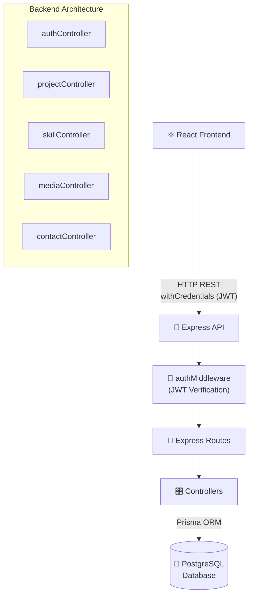
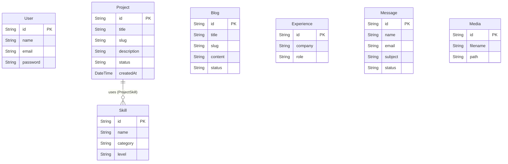

# Portfolio CMS - Backend

> A robust, secure Express.js REST API powering a dynamic portfolio website and its companion Content Management System (CMS).


---

## ✨ Features

- 🔐 **Secure Authentication** — JWT-based authentication using `httpOnly` cookies.
- 🗄️ **Relational Database** — PostgreSQL managed via Prisma ORM for type-safe database queries.
- 📂 **Media Management** — Integrated `multer` for handling image and document uploads.
- 🌐 **Public & Private APIs** — Read-only public endpoints for the frontend portfolio, and protected CRUD endpoints for the CMS dashboard.
- 🛡️ **Error Handling** — Centralized error handling and robust validation.

---

## 🏗️ System Architecture



---

## 🗄️ Database Schema (ER Diagram)



---

## 📁 Project Structure

```text
backend/
├── app.js                    # Express application setup & middleware
├── controllers/              # Business logic for all endpoints
├── middleware/               # Custom middlewares (auth, upload)
├── routes/                   # Express route definitions
├── prisma/
│   └── schema.prisma         # Database schema & models
└── package.json
```

---

## ⚡ Quick Start

### 1. Install Dependencies

```bash
cd backend
npm install
```

### 2. Database Setup

Apply database migrations and generate Prisma client:

```bash
npx prisma migrate dev
```

### 3. Start the Server

```bash
npm run dev
```
The API will be running on `http://localhost:3000`.

---

## 🔌 API Reference

### 🌐 Public Endpoints (No Auth Required)
| Method | Endpoint | Description |
|--------|----------|-------------|
| GET | `/api/public/projects` | Fetch published projects |
| GET | `/api/public/skills` | Fetch all skills |
| GET | `/api/public/blogs` | Fetch published blogs |
| POST | `/api/contact` | Submit a new contact message |

### 🔐 Admin Endpoints (JWT Required)
| Method | Endpoint | Description |
|--------|----------|-------------|
| POST | `/api/admin/login` | Authenticate user & set cookie |
| POST | `/api/admin/projects` | Create a new project |
| PUT | `/api/admin/projects/:id` | Update an existing project |
| DELETE | `/api/admin/projects/:id` | Delete a project |
| POST | `/api/admin/media/upload` | Upload a new media file |

---

## 🚀 Deployment (Railway)

1. Connect your GitHub repository to Railway.
2. Set the Root Directory to `backend`.
3. Railway will automatically detect the Node.js environment and deploy the server.
